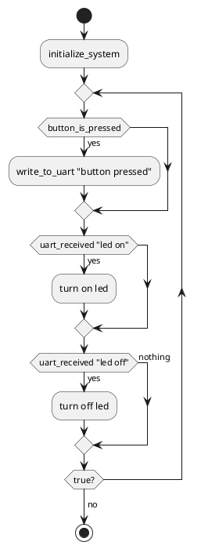

```plantuml

@startuml
start

:initialize_system;
repeat
if (button_is_pressed) then (yes)
  :write_to_uart "button pressed";
endif
if (uart_received "led on") then (yes)
  :turn on led;
endif
if (uart_received "led off") then (yes)
  :turn off led;
else (nothing)

endif

repeat while (true?)
->no;
stop
@enduml

```